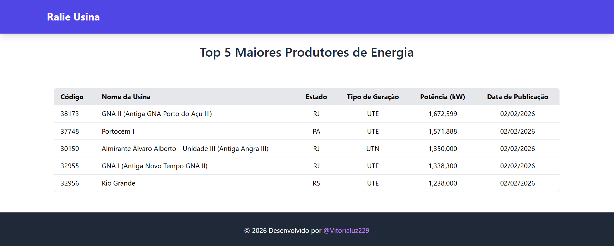

[](https://github.com/Vitorialuz229/desafio_bolt_geradores_frontend/blob/main/README-EN.md)

# Desafio Bolt Geradores Frontend

Aplicação frontend responsável por consumir uma API REST que fornece dados normalizados do conjunto de dados RALIE da ANEEL, apresentando os 5 maiores produtores de energia do Brasil em uma interface amigável.

## Imagem do Projeto


## Tecnologias Utilizadas

- **Angular**: Framework para desenvolvimento de SPA (Single Page Application).
- **TailwindCSS**: Framework utilitário para estilização rápida e responsiva.
- **Node.js**: Ambiente de execução para JavaScript no servidor.
- **RxJS**: Para gerenciar fluxos assíncronos de dados com Observables.
- **HTTPClient**: Serviço para fazer requisições HTTP à API REST.

## Pré-requisitos

Para rodar o projeto localmente, você precisa ter instalado:

- **Node.js**: [Instalar Node.js](https://nodejs.org/)
- **Angular CLI**: Instale o Angular CLI globalmente, se ainda não o fez:

  ```bash
  npm install -g @angular/cli
  ```

## Como Rodar o Projeto
Passo 1: Clonar o Repositório

Clone o repositório para sua máquina local:

```bash
    git clone https://github.com/Vitorialuz229/desafio_bolt_geradores_frontend.git
    cd desafio_bolt_geradores_frontend
```

## Passo 2: Instalar Dependências

Instale todas as dependências do projeto:

```bash
    npm install
```

## Passo 3: Rodar o Projeto Localmente

Para rodar o servidor de desenvolvimento local:

```bash
    ng serve
```

Isso iniciará o servidor em `http://localhost:4200/.` Abra seu navegador e acesse a URL para ver a aplicação em funcionamento.

## Funcionalidade

A aplicação consome uma API REST que retorna os 5 maiores produtores de energia do Brasil. O frontend exibe as informações de maneira clara e responsiva, utilizando uma tabela que apresenta os dados, como:

- Código da Usina
- Nome da Usina
- Estado (UF)
- Tipo de Geração
- Potência Outorgada (em kW)
- Data de Publicação


## Autora
Vitória Luz Alves D' Abadia